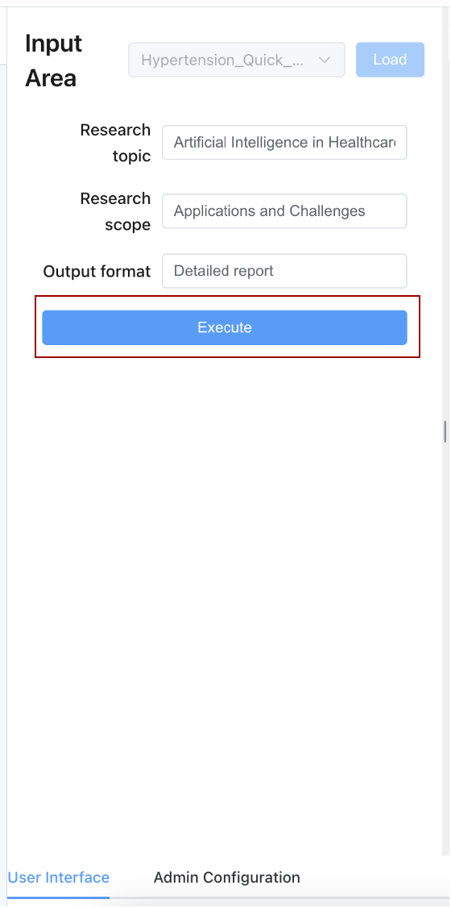

# Shenyu [中文] | [English](README.md) 

[](https://opensource.org/licenses/MIT)

Shenyu 是一个强大的 AI 对话平台，支持多种 AI 模型和可扩展的插件系统。
重点是其创新地采用了问卷式交互方式来创造AI Agent，有效避免了对话式交互头脑放空的问题。
AI Agent的配置也是公开展示的，方便prompt调优

## Demo
http://139.224.248.148/sn43
丐中丐服务器

## AI Agent 生成器 功能指南

中文视频：
https://flowus.cn/long-arena/share/0e914d6b-d9c8-48c9-bcdd-564d0f34eaee?code=Z97DJQ


创建包含10个prompt blocks的深度研究智能体：

1. 进入SN43页面的后台配置页面
2. 在AI agent文本框中输入："有10个promptblock输出的深度研究agent"
3. 点击"生成AI智能体"按钮
4. 切换到用户界面
5. 点击"执行"按钮即可体验智能体的效果


*AI智能体配置面板*


*AI智能体执行界面*

## 特性

- 🚀 支持多种 AI 模型（DeepSeek、Kimi、阿里云等）
- 💬 实时流式响应
- 🔌 可扩展的插件系统
- 📝 对话历史记录持久化
- 🌐 WebSocket 长连接支持
- 🔄 智能并发控制
- 📊 内置性能测试工具
- 🎨 优雅的用户界面

## 快速开始

### 环境要求

- Node.js >= 18
- npm >= 9

### 安装

1. 克隆仓库
```bash
git clone https://github.com/billbai-longarena/shenyu.git
cd shenyu
```

2. 安装依赖
```bash
# 安装所有依赖（包括前端和后端）
npm install
npm run setup
```

3. 配置环境变量
```bash
# 后端配置
cd packages/backend
cp .env.example .env
# 编辑 .env 文件，填入您的 API 密钥
```

注意：项目采用与OpenAI API兼容的方式调用模型。您只需要：
1. 在.env文件中配置任意模型的API密钥
2. 在界面中选择相应的模型
3. 如果遇到header格式问题，可以在modelservice中调整header格式

由于作者没有OpenAI的API访问权限，OpenAI的兼容性尚未完全测试。

### 故障排除

1. 依赖安装问题
- 如果遇到依赖安装错误，尝试单独安装：
```bash
cd packages/backend && npm install
cd ../frontend && npm install
```
- 确保Node.js版本 >= 18，npm版本 >= 9

2. 端口占用问题
- 默认端口：前端8080，后端3001
- 启动脚本会自动检测并尝试释放被占用的端口
- 也可以通过环境变量指定其他端口：
```bash
PORT=3002 npm run dev:backend
PORT=8081 npm run dev:frontend
```

3. 后端服务问题
- 确保.env文件配置正确
- 检查API密钥是否有效
- 查看后端日志输出的详细错误信息

4. 前端服务问题
- 确保后端服务已启动并可访问
- 检查浏览器控制台是否有错误信息
- 如果页面加载异常，尝试清除浏览器缓存

5. WebSocket连接问题
- 确保防火墙未阻止WebSocket连接
- 检查后端服务是否正常运行
- 验证WebSocket端口（3001）是否可访问

### 开发

#### Windows

1. 安装依赖
```bash
# 在项目根目录下运行
npm install
npm run setup
```

2. 配置后端环境
```bash
# 进入后端目录
cd packages/backend
# 创建.env文件（如果不存在）
copy .env.example .env
# 编辑.env文件，填入必要的API密钥
# KIMI_API_KEY=your_api_key_here
# PORT=3001
# HOST=localhost
```

3. 启动后端服务
```bash
# 在项目根目录下运行
npm run dev -w @shenyu/backend
```

4. 启动前端开发服务器
```bash
# 新开一个终端，在项目根目录下运行
npm run dev -w @shenyu/frontend
```

服务启动后：
- 前端访问地址：http://localhost:8080
- 后端服务地址：http://localhost:3001
- WebSocket服务：ws://localhost:3001

注意事项：
- 确保Node.js版本 >= 18
- 确保npm版本 >= 9
- 后端服务必须运行在3001端口
- 如果遇到端口占用，请先结束占用端口的进程
- 首次运行时需要配置API密钥才能正常使用AI模型服务

#### Linux/macOS

项目提供了便捷的启动脚本，默认端口配置如下：

- 前端：8080
- 后端：3001

1. 启动后端服务
```bash
./scripts/start-backend.sh
# 或指定其他端口
PORT=3002 ./scripts/start-backend.sh
```

2. 启动前端开发服务器
```bash
# 新开一个终端
./scripts/start-frontend.sh
# 或指定其他端口
PORT=8081 ./scripts/start-frontend.sh
```

这些脚本会自动：
- 检查端口占用情况并提供友好提示
- 安装依赖
- 加载环境变量
- 启动开发服务器

注意：
- 如果需要同时运行多个实例，请使用不同的端口
- 修改前端端口后，需要相应修改后端的CORS配置
- 建议在开发时保持默认端口，除非有特殊需求

### 生产部署

1. 构建前端
```bash
cd packages/frontend
npm run build
```

2. 构建后端
```bash
cd packages/backend
npm run build
```

3. 启动服务
```bash
# 启动前端
cd packages/frontend
npm run preview

# 启动后端
cd packages/backend
npm start
```


## 项目结构

```
shenyu/
├── packages/
│   ├── frontend/     # 前端项目
│   │   ├── src/     # 源码
│   │   ├── public/  # 静态资源
│   │   └── dist/    # 构建输出
│   └── backend/     # 后端项目
│       ├── src/     # TypeScript 源码
│       └── dist/    # 构建输出
├── docs/            # 项目文档
└── scripts/         # 工具脚本
```

## 文档

- [开发指南](docs/guide/index.md)
- [API 文档](docs/api/chat-completions.md)
- [组件文档](docs/components/execution-panel.md)
- [状态管理最佳实践](docs/guide/state-management-best-practices.md) [中文]
- [双语文档维护指南](docs/guide/bilingual-docs-best-practices.md) [中文]
- [新增大模型最佳实践](docs/guide/add-model-best-practices.md) [中文]
- [更新日志](docs/changelog.md)
- [测试指南](docs/guide/testing-guide.md) [中文]

## 插件开发

Shenyu 支持通过插件系统扩展 AI 模型支持。查看[插件开发指南](docs/guide/plugin-development.md)了解如何开发自己的模型插件。

## 贡献指南

我们欢迎任何形式的贡献！请查看 [CONTRIBUTING.md](CONTRIBUTING.md) 了解如何参与项目开发。

## 安全

如果您发现了安全漏洞，请查看我们的 [安全策略](SECURITY.md) 了解如何报告。

## 许可证

本项目采用 MIT 许可证 - 查看 [LICENSE](LICENSE) 了解详情

## 致谢

感谢所有为这个项目做出贡献的开发者！

## 联系我们

- 提交 Issue
- 项目讨论区
- 邮件联系 bill.bai@long-arena.com

## 状态徽章


